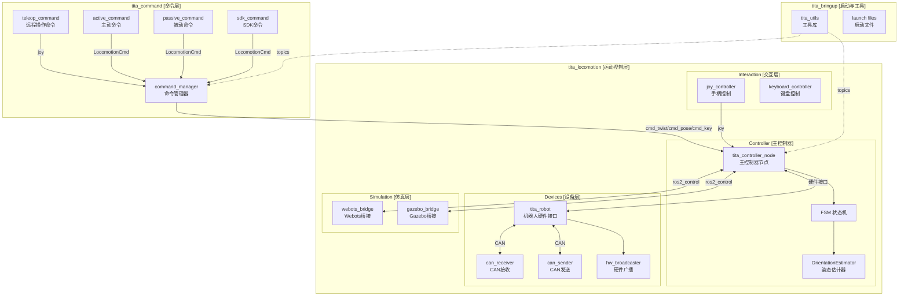
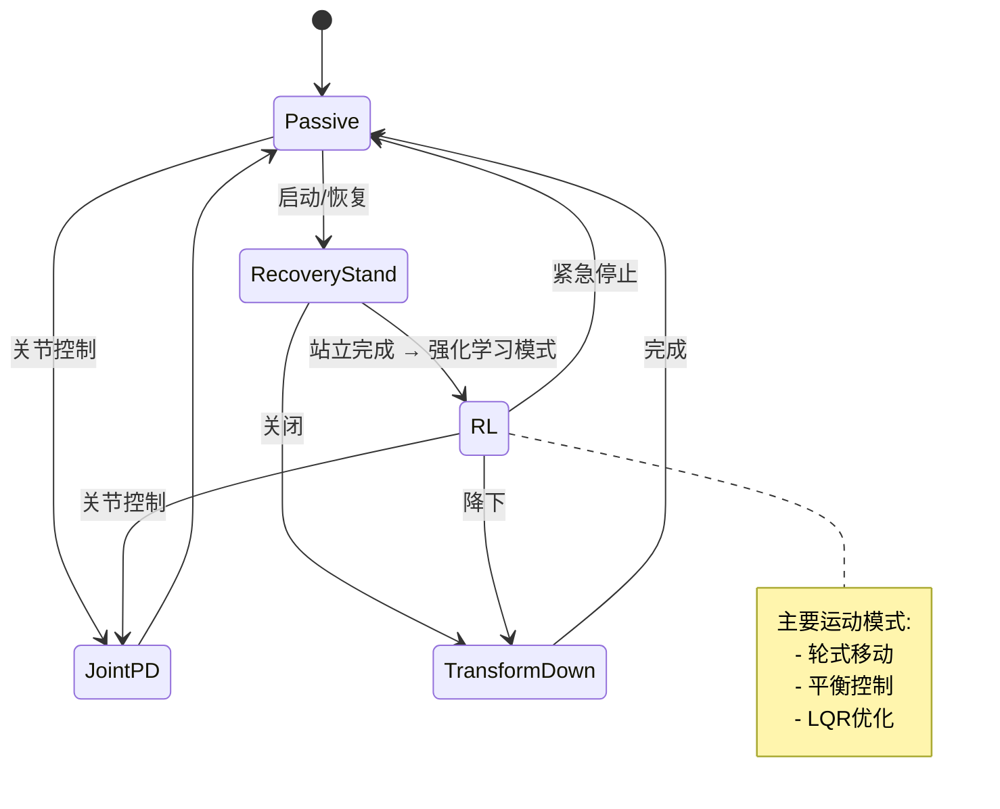
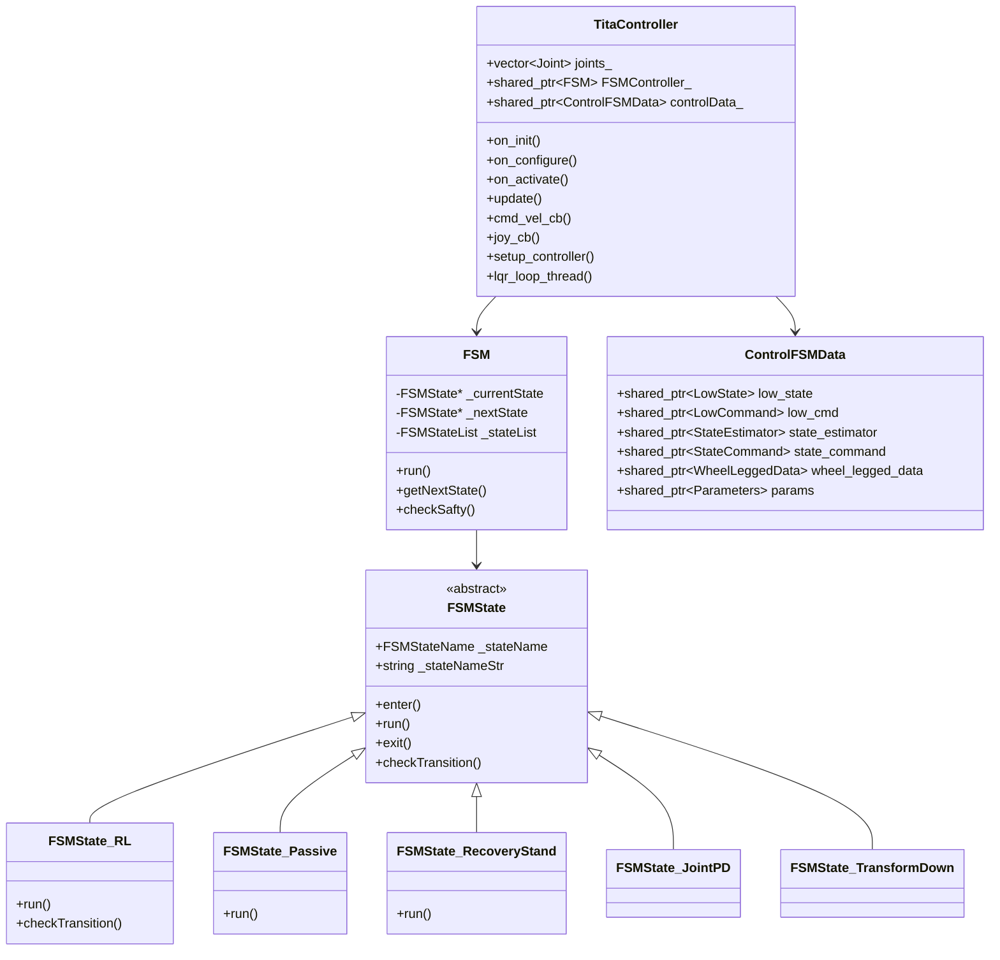
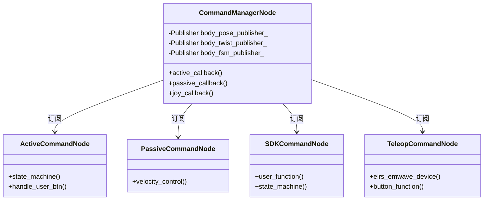
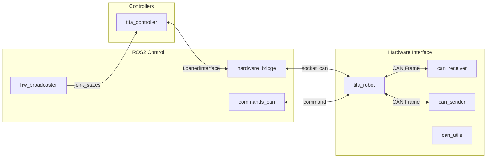
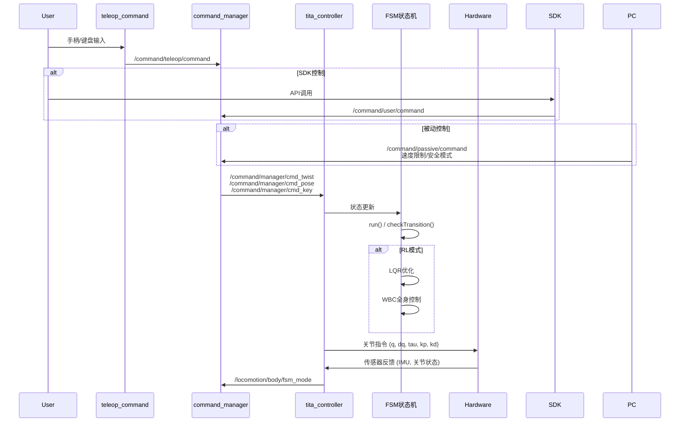
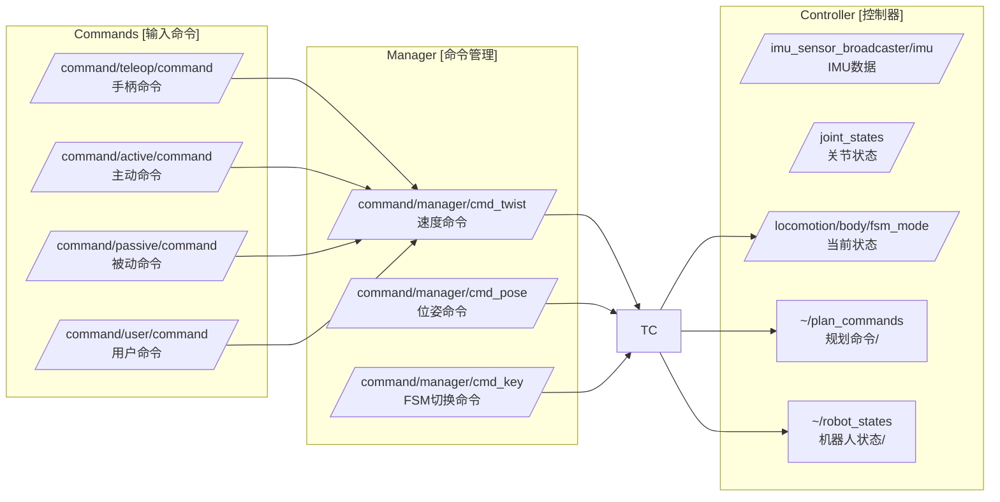
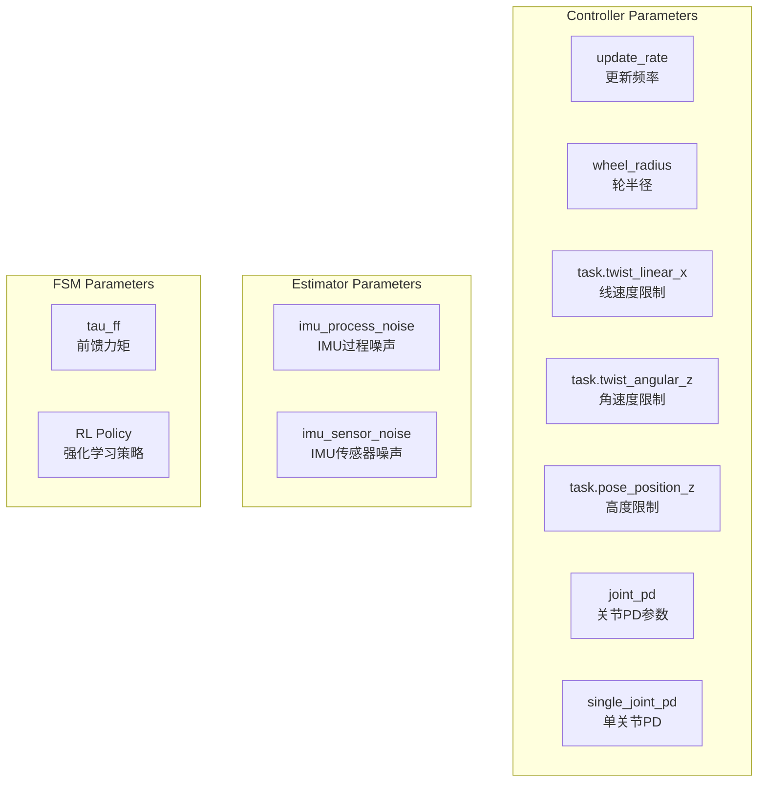

# TITA 机器人项目代码架构图

## 项目总览

这是一个 ROS2 机器人控制系统，用于 TITA 轮腿机器人的运动控制和命令管理。



## FSM 状态机详解



## 类图

### 主控制器类



### 命令管理类



## 设备通信架构



## 数据流向



## 关键 Topic 通信图



## 模块目录结构

```
tita_rl_sim2sim2real/src/
├── tita_locomotion/                 # 运动控制模块
│   ├── tita_controllers/
│   │   └── tita_controller/         # 主控制器
│   │       ├── include/
│   │       │   ├── tita_controller/
│   │       │   ├── fsm/            # 状态机
│   │       │   ├── estimator/      # 估计器
│   │       │   └── planner/        # 规划器
│   │       └── src/
│   ├── devices/                     # 硬件设备
│   │   ├── commands_can/           # CAN命令
│   │   ├── hardware_bridge/        # 硬件桥接
│   │   ├── hw_broadcaster/         # 硬件广播
│   │   └── tita_robot/             # 机器人硬件接口
│   ├── interaction/                 # 交互
│   │   ├── joy_controller/         # 手柄控制
│   │   └── keyboard_controller/    # 键盘控制
│   ├── libraries/                   # 库
│   │   └── qpoases/                # QP求解器
│   └── tita_webots_ros2/           # 仿真支持
│
├── tita_command/                    # 命令模块
│   ├── command_manager/            # 命令管理器
│   ├── active_command/             # 主动命令
│   ├── passive_command/            # 被动命令
│   ├── sdk_command/                # SDK命令
│   └── teleop_command/             # 远程操作
│
└── tita_bringup/                    # 启动配置
    ├── include/tita_utils/         # 工具库
    ├── launch/                     # 启动文件
    └── config/                     # 配置文件
```

## 核心参数配置



---

*生成时间: 2026-03-24*
*项目: TITA Robot ROS2 Control System*
